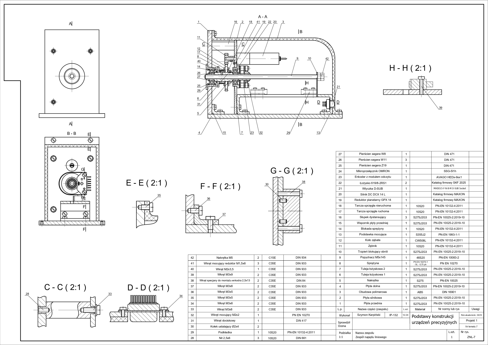
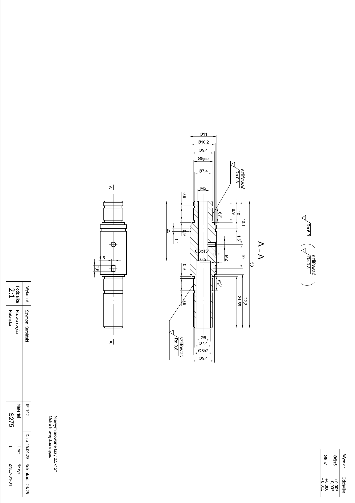
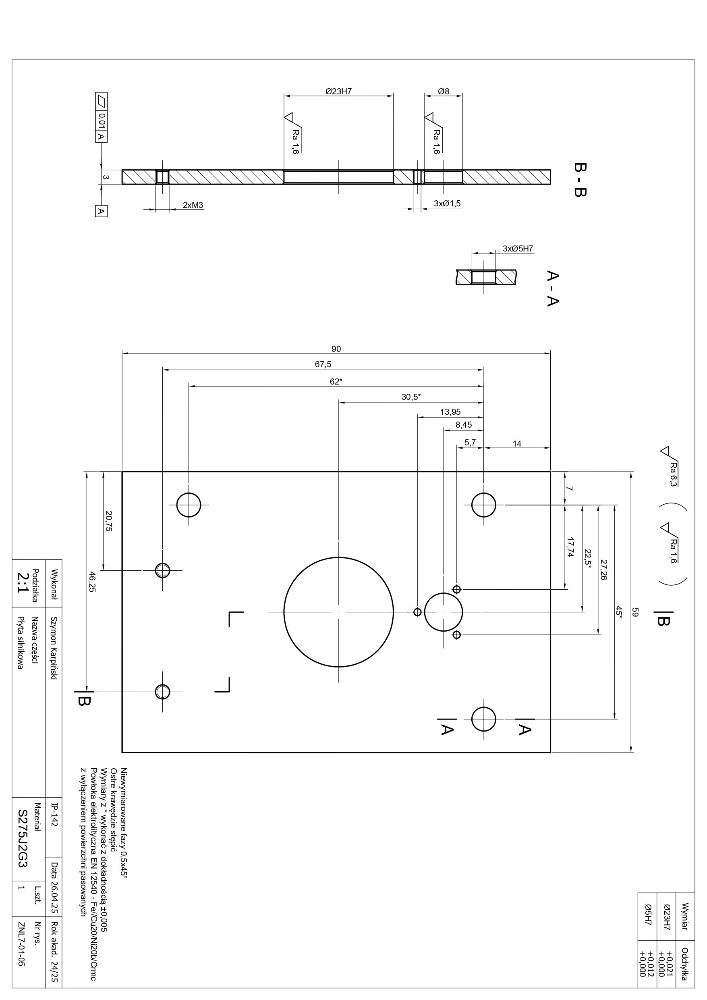
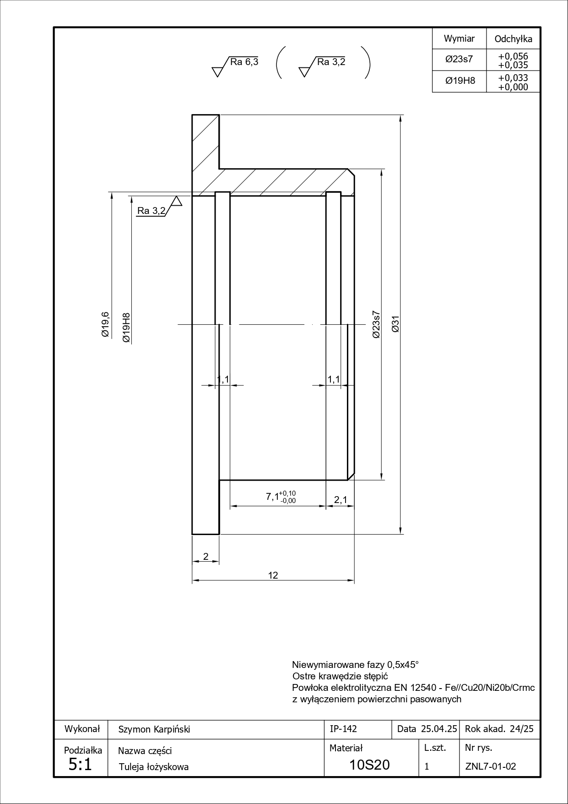
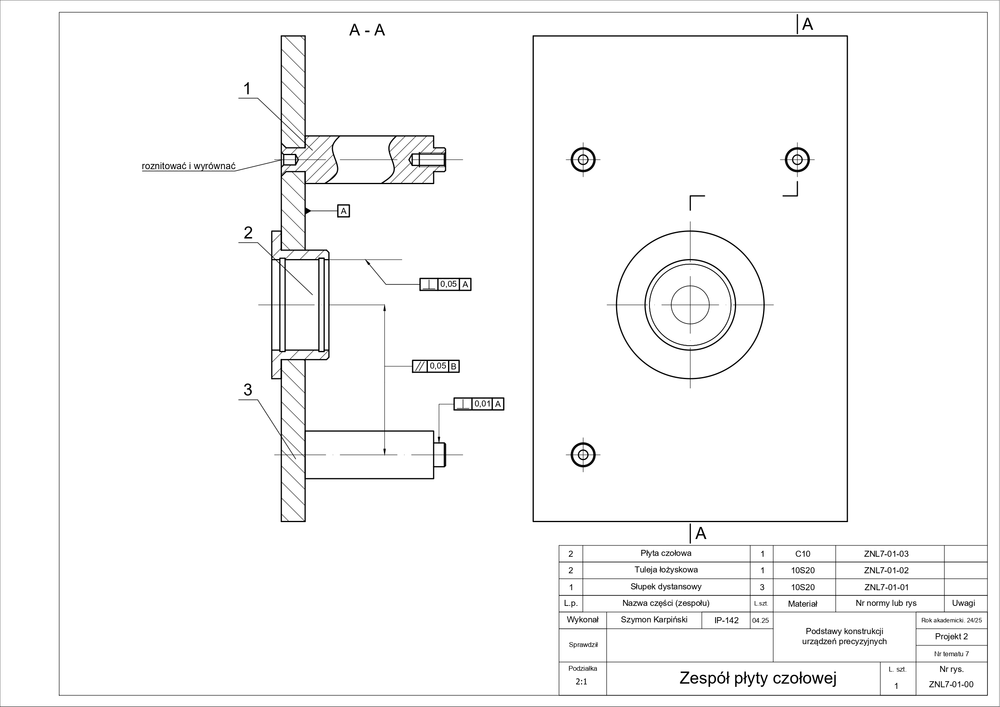

# Zespół Napędu liniowego
## Opis projektu:
Celem projektu jest opracowanie układu umożliwiającego kontrolowany ruch liniowy popychacza z zachowaniem wysokiej dokładności oraz niezawodności pracy.
## Dokumentacja
Dokumentacja projektu wraz z obliczeniami: [DokumentacjaZNL](DokumentacjaSzKarpinski.pdf)
## Rysunek złożeniowy

## Nakrętka

## Płyta silnikowa

## Tuleja

## Zespół płyty

